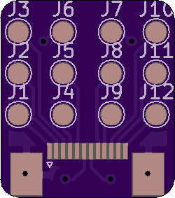
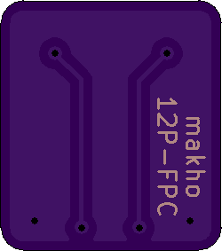

# 12p-ffc
A 12 pin FFC breakout board fpr 12 pin 0.5mm pitch FFC cables

You need these PCBs (flex board preferred but the thinner the better otherwise), some 12 pin 0.5mm pitch flat flex cables, and some 12 pin 0.5mm pitch connectors. 

NOTE: It is important that the cable itself terminates on opposite sides OR that you use a top connect connector or a bottom connect connector otherwise the pin numbers will NOT match on either side (12 ≠ 12, 12 = 1)

Parts I used:
* [0.5mm pitch flat flex cable (same side termination)](https://www.aliexpress.com/item/32970287189.html)
* [0.5mm pitch flat flex connector (bottom contact)](https://www.aliexpress.com/item/32956902542.html)
* [0.5mm pitch flat flex connector (top contact)](https://www.aliexpress.com/item/32958184639.html)
* [the PCBs listed in this repo](https://oshpark.com/shared_projects/38voxUwq)

Yes, I used all four of these. One board has the top connect connectors and the other has the bottom connect connecotrs. Please see [this video]() for more info and install, otherwise this project should be relatively self explanatory. 

#Board Renders

